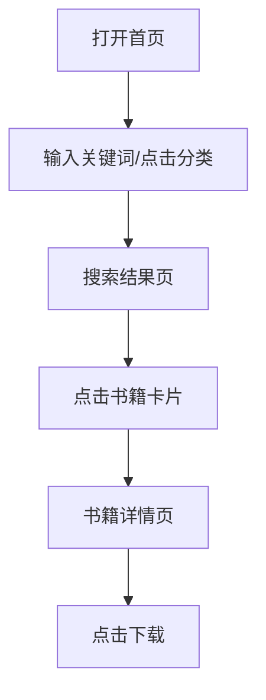

# 产品需求文档（PRD）—— 在线图书站

## 1. 产品概述
一个简洁优雅的在线电子书检索与下载站点，帮助用户快速查找并获取感兴趣的电子书资源。面向热爱阅读、需要便捷获取电子书的普通用户。

## 2. 核心功能

### 2.1 用户角色
| 角色 | 注册方式 | 核心权限 |
|------|----------|----------|
| 普通访客 | 无需注册 | 检索书籍、查看详情、下载电子书 |

### 2.2 功能模块
1. **首页**：全局搜索、分类导航、热门书籍推荐
2. **搜索结果页**：关键词高亮、分类筛选、排序、分页书籍列表
3. **书籍详情页**：书籍元信息展示、简介、下载入口

### 2.3 页面详情
| 页面名称 | 模块名称 | 功能描述 |
|----------|----------|----------|
| 首页 | 顶部搜索区 | 居中大搜索框，支持关键词输入并跳转结果页 |
| 首页 | 分类导航 | 展示常用分类标签（文学、科技、历史、艺术等），点击跳转搜索 |
| 首页 | 热门推荐 | 展示 8 本热门书籍卡片，点击跳转详情页 |
| 搜索结果页 | 筛选栏 | 按分类、格式（PDF/EPUB/MOBI）、语言筛选 |
| 搜索结果页 | 书籍列表 | 卡片式展示封面、书名、作者、评分、简介摘要 |
| 搜索结果页 | 排序与分页 | 支持按相关度/评分/时间排序，分页加载 |
| 书籍详情页 | 信息展示区 | 封面大图、书名、作者、出版社、出版年份、页数、语言、评分 |
| 书籍详情页 | 下载区 | 提供多种格式下载按钮（PDF/EPUB/MOBI） |

## 3. 核心流程

用户打开首页 → 在搜索框输入关键词或点击分类标签 → 进入搜索结果页浏览列表 → 点击感兴趣的书籍 → 进入详情页查看信息 → 点击下载按钮获取电子书。

## 4. 用户界面设计

### 4.1 设计风格
- **整体风格**：现代简约编辑风，带有图书馆的温暖纸质感，拒绝俗套渐变
- **主色调**：背景 `#F6F4EF`（暖纸白），主色 `#1E3A5F`（深墨蓝），强调色 `#C75B39`（砖红）
- **按钮风格**：主按钮使用深墨蓝底白字，悬停时微缩放；下载按钮使用砖红色，突出行动号召
- **字体**：标题使用 `Playfair Display`（衬线体，优雅书卷气），正文使用 `Source Sans 3`（无衬线，清晰易读）
- **布局风格**：顶部固定导航栏，内容区居中最大宽度 1200px，卡片式网格布局
- **图标**：全部使用 `lucide-react` 线性图标

### 4.2 页面设计概述
| 页面名称 | 模块名称 | UI 元素 |
|----------|----------|---------|
| 首页 | 搜索区 | 超大圆角搜索框，带搜索图标，聚焦时边框变为砖红色，有轻微阴影 |
| 首页 | 分类导航 | 横向排列的圆角标签，悬停上浮并变色 |
| 首页 | 热门推荐 | 4 列网格卡片，封面图上方悬浮显示下载量，卡片悬停阴影加深、轻微上移 |
| 搜索结果页 | 筛选栏 | 左侧边栏（桌面端）/ 顶部横条（移动端），复选框筛选 |
| 搜索结果页 | 书籍列表 | 左侧封面缩略图 + 右侧信息，列表项悬停背景微变 |
| 书籍详情页 | 信息区 | 左侧大图 + 右侧文字信息，封面带轻微纸张纹理阴影 |
| 书籍详情页 | 下载区 | 大尺寸下载按钮，带格式图标，点击后模拟下载反馈 |

### 4.3 响应式设计
- **桌面优先**：三栏/双栏布局，充分利用宽屏空间展示书籍封面
- **平板适配**：搜索结果页变为单栏，筛选收起为抽屉
- **移动端**：首页搜索框全宽，热门推荐变为 2 列网格，详情页封面与信息上下堆叠

### 4.4 动效与交互
- 页面加载：卡片 staggered fade-in 动画（`animation-delay` 递增）
- 搜索框聚焦：边框颜色过渡 + 轻微阴影扩散
- 卡片悬停：`translateY(-4px)` + 阴影加深，过渡 200ms ease-out
- 下载按钮点击：缩放脉冲反馈，显示 toast 提示“开始下载”
- 页面切换：淡入淡出过渡
