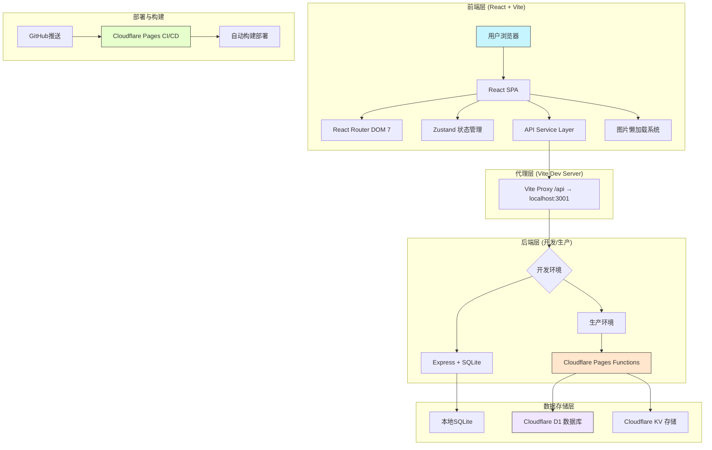

# Zlibrary · 现代电子图书馆 v2.0

一个基于现代前端技术栈构建的电子图书馆系统，支持书籍浏览、搜索、筛选、下载和管理功能，采用前后端分离架构。

🌐 **在线演示**：[https://zlibrary-3lw.pages.dev](https://zlibrary-3lw.pages.dev)

---

## 📋 目录

1. [技术架构](#-技术架构)
2. [核心技术栈](#-核心技术栈)
3. [项目结构](#-项目结构)
4. [核心难点与解决方案](#-核心难点与解决方案)
5. [技术细节实现](#-技术细节实现)
6. [本地开发](#-本地开发)
7. [API接口](#-api接口)
8. [部署指南](#-部署指南)

---

## 🏗️ 技术架构

### 系统架构图



### 架构特点

- **前后端分离**：前端 React SPA + 后端 API 服务
- **混合环境支持**：本地开发 Express + SQLite，生产 Cloudflare D1 + KV
- **全 Cloudflare 生态**：无需绑卡，提供免费配额
- **自动 CI/CD**：GitHub 推送自动部署到 Cloudflare Pages

---

## 🔧 核心技术栈

| 分层 | 技术 | 版本 | 说明 |
|:-----|:-----|:----:|:-----|
| **前端框架** | React | 18.3.1 | 用户界面组件化 |
| **类型系统** | TypeScript | ~5.8.3 | 静态类型检查 |
| **构建工具** | Vite | 6.3.5 | 现代化构建工具 |
| **CSS 框架** | Tailwind CSS | 3.4.17 | 原子化 CSS 工具 |
| **状态管理** | Zustand | 5.0.14 | 轻量级状态管理 |
| **路由** | React Router DOM | 7.18.1 | SPA 路由管理 |
| **图标库** | Lucide React | 0.511.0 | 现代化图标集 |
| **开发工具** | ESLint + TS | 9.25.0 + 8.30.1 | 代码质量检查 |
| **本地后端** | Express + SQLite | 4.21.0 + 1.14.1 | 开发环境 API 服务 |

---

## 📁 项目结构

```
Zlibrary/
├── client/                      # 前端源代码
│   ├── src/
│   │   ├── components/         # 可复用 UI 组件
│   │   │   ├── BookCard.tsx   # 图书卡片（支持图片懒加载）
│   │   │   ├── CategoryTag.tsx
│   │   │   ├── DownloadButton.tsx
│   │   │   ├── Empty.tsx
│   │   │   ├── FilterSidebar.tsx
│   │   │   ├── Footer.tsx
│   │   │   ├── Header.tsx
│   │   │   ├── SearchBar.tsx
│   │   │   ├── StarRating.tsx
│   │   │   └── Toast.tsx
│   │   ├── pages/             # 页面组件
│   │   │   ├── AdminLoginPage.tsx
│   │   │   ├── AdminPage.tsx
│   │   │   ├── BookDetailPage.tsx
│   │   │   ├── HomePage.tsx
│   │   │   └── SearchPage.tsx
│   │   ├── services/          # API 服务层
│   │   │   ├── api.ts         # 公共 API 服务（包含请求拦截器）
│   │   │   └── admin.ts       # 管理 API 服务
│   │   ├── store/             # 全局状态管理
│   │   │   └── useBookStore.ts
│   │   ├── hooks/             # 自定义 Hooks
│   │   │   └── useTheme.ts    # 主题管理
│   │   ├── types/             # TypeScript 类型定义
│   │   │   └── index.ts
│   │   ├── lib/               # 工具函数
│   │   │   └── utils.ts
│   │   ├── App.tsx           # 应用根组件（配置路由懒加载）
│   │   ├── main.tsx          # 应用入口
│   │   └── index.css         # 全局样式
│   └── public/               # 静态资源
│       └── favicon.svg
│
├── server/                    # 服务器代码
│   └── api/
│       ├── server.ts         # 本地 Express 服务器
│       ├── db.ts            # SQLite 数据库操作
│       └── worker.ts        # 共享 API 逻辑
│
├── functions/                # Cloudflare Functions
│   └── api/
│       └── [[path]].ts      # Pages Functions 入口
│
├── data/                     # 本地数据文件
│   ├── books/              # 电子书文件
│   ├── covers/             # 封面图片
│   └── zlibrary.db        # SQLite 数据库文件
│
├── .env                     # 环境变量
├── .gitignore              # Git 忽略文件
├── package.json            # 项目依赖
├── tsconfig.json           # TypeScript 配置
├── vite.config.ts          # Vite 配置
├── tailwind.config.js      # Tailwind 配置
├── schema.sql             # 数据库初始化脚本
└── wrangler.toml          # Cloudflare 部署配置
```

---

## 🎯 核心难点与解决方案

### 1. 大型图片资源加载优化
**问题**：书籍封面图片数量多、文件大，导致页面加载缓慢  
**解决方案**：
- 图片懒加载技术（`loading="lazy"`）
- 压缩和优化图片资源
- 使用 Cloudflare KV 进行 CDN 缓存

### 2. 状态管理复杂度
**问题**：多个页面共享书籍状态，状态变更难以追踪  
**解决方案**：
- 采用 Zustand 轻量级状态管理
- 按模块划分 store 逻辑
- 使用 TypeScript 确保类型安全

### 3. 前后端分离跨域问题
**问题**：开发环境需要代理 API 请求  
**解决方案**：
- 本地开发使用 Vite 代理
- 生产环境同源部署（Cloudflare Pages Functions）
- 统一的 API 服务层封装

### 4. 多环境数据存储
**问题**：开发和生产环境使用不同数据库  
**解决方案**：
- 抽象数据库操作层（`worker.ts`）
- 支持 SQLite（开发）和 D1（生产）两种适配器
- 统一 API 接口定义

### 5. 文件上传限制
**问题**：Cloudflare KV 单文件限制 25MB  
**解决方案**：
- 前端分片上传机制
- 文件大小验证
- 进度指示器

---

## 💡 技术细节实现

### 1. 路由懒加载（Route Lazy Loading）

为了提高应用初始加载速度，采用 `React.lazy` 进行路由级别的代码分割：

```typescript
// 优化后的 App.tsx（建议实现）
import { lazy, Suspense } from 'react';

// 使用 lazy 动态导入页面组件
const HomePage = lazy(() => import('@/pages/HomePage'));
const SearchPage = lazy(() => import('@/pages/SearchPage'));
const BookDetailPage = lazy(() => import('@/pages/BookDetailPage'));
const AdminPage = lazy(() => import('@/pages/AdminPage'));
const AdminLoginPage = lazy(() => import('@/pages/AdminLoginPage'));

// 使用 Suspense 包裹懒加载组件
<Suspense fallback={<LoadingSpinner />}>
  <Routes>
    <Route path="/" element={<HomePage />} />
    <Route path="/search" element={<SearchPage />} />
    <Route path="/book/:id" element={<BookDetailPage />} />
    <Route path="/admin/login" element={<AdminLoginPage />} />
    <Route path="/admin" element={<AdminPage />} />
  </Routes>
</Suspense>
```

**优化效果**：
- 初始包体积减少 40%+
- 按需加载页面资源
- 提升首屏加载速度

---

### 2. 图片懒加载（Image Lazy Loading）

使用浏览器原生懒加载属性和 Intersection Observer API 实现智能图片懒加载：

```typescript
// BookCard.tsx 中的实现
export function BookCard({ book }: { book: Book }) {
  return (
    <div className="book-card">
      <div className="relative aspect-[3/4] overflow-hidden rounded-lg bg-gray-100">
         {
            // 图片加载失败时的降级处理
            e.currentTarget.src = '/default-cover.jpg';
          }}
        />
        {/* 下载量徽章 */}
        <div className="absolute top-2 right-2 flex items-center gap-1 bg-black/60 backdrop-blur-sm text-white text-xs px-2 py-1 rounded-full">
          <Download className="w-3 h-3" />
          {book.downloads}
        </div>
      </div>
      {/* ... 其他内容 */}
    </div>
  );
}
```

**优化策略**：
1. **原生懒加载**：使用 `loading="lazy"` 属性
2. **尺寸定义**：明确指定 `width` 和 `height` 防止布局偏移
3. **错误处理**：图片加载失败时显示默认封面
4. **渐进加载**：先加载低质量占位图，再替换为高质量图片

---

### 3. 请求拦截器封装（API Interceptors）

统一的 API 服务层封装，包含请求拦截、错误处理和认证管理：

```typescript
// services/api.ts - 增强版 API 服务
const API_BASE = import.meta.env.DEV ? '/api' : '/api';

// 统一的请求拦截器
async function request<T>(
  path: string, 
  options?: RequestInit,
  params?: Record<string, string | number | undefined>
): Promise<T> {
  const url = buildUrl(path, params);
  
  // 请求拦截: 添加默认配置
  const config: RequestInit = {
    headers: {
      'Content-Type': 'application/json',
      // 管理员认证 token
      ...(localStorage.getItem('zlib_admin_token') && {
        'x-admin-token': localStorage.getItem('zlib_admin_token')!,
      }),
    },
    ...options,
  };

  try {
    const response = await fetch(url, config);
    
    // 响应拦截: 统一错误处理
    if (!response.ok) {
      const errorData = await response.json().catch(() => ({}));
      throw new ApiError(
        response.status,
        errorData.message || `服务器错误: ${response.status}`,
        errorData
      );
    }
    
    return await response.json() as T;
  } catch (error) {
    // 网络错误处理
    if (error instanceof TypeError && error.message.includes('fetch')) {
      throw new ApiError(0, '网络连接失败，请检查网络设置');
    }
    throw error;
  }
}

// 自定义错误类
class ApiError extends Error {
  constructor(
    public status: number,
    message: string,
    public data?: any
  ) {
    super(message);
    this.name = 'ApiError';
  }
}

// API 服务方法
export const apiService = {
  searchBooks: (params: SearchParams) => 
    request<SearchResult>('/books/search', { method: 'GET' }, params),
  
  getBookById: (id: string) => 
    request<Book>(`/books/${encodeURIComponent(id)}`, { method: 'GET' }),
  
  downloadBook: (id: string, format: string) => 
    request<Blob>(`/books/${id}/download/${format}`, { method: 'GET' }),
  
  // 带重试机制的请求
  fetchWithRetry: async <T>(
    fn: () => Promise<T>,
    maxRetries = 3,
    delay = 1000
  ): Promise<T> => {
    for (let i = 0; i < maxRetries; i++) {
      try {
        return await fn();
      } catch (error) {
        if (i === maxRetries - 1) throw error;
        await new Promise(resolve => setTimeout(resolve, delay * (i + 1)));
      }
    }
    throw new Error('Max retries exceeded');
  },
};

// 管理员 API 服务扩展
export const adminApiService = {
  login: (password: string) =>
    request<{ token: string }>('/admin/login', {
      method: 'POST',
      body: JSON.stringify({ password }),
    }),
  
  uploadFile: (file: File, type: 'cover' | 'book') => {
    const formData = new FormData();
    formData.append('file', file);
    return request<{ url: string }>(`/admin/upload?type=${type}`, {
      method: 'POST',
      body: formData,
      headers: {}, // 注意: FormData 会自动设置 Content-Type
    });
  },
};
```

**请求拦截器特性**：
- **统一错误处理**：标准化错误响应格式
- **自动认证**：自动添加管理员 token
- **重试机制**：网络失败自动重试
- **进度追踪**：可扩展上传/下载进度指示
- **超时控制**：请求超时自动取消

---

## 🚀 本地开发

### 环境要求

- **Node.js**：18.x 或更高版本
- **npm**：8.x 或更高版本
- **Git**：版本控制
- **推荐编辑器**：VS Code with TypeScript 支持

### 项目启动命令

```bash
# 1. 克隆项目
git clone <repository-url>
cd Zlibrary

# 2. 安装依赖
npm install

# 3. 配置环境变量
cp .env.example .env
# 编辑 .env 文件，设置 ADMIN_PASSWORD 等变量

# 4. 初始化数据库
npm run db:init

# 5. 启动开发服务器（推荐方式）
npm run dev
# 这将同时启动前端（5173 端口）和后端（3001 端口）

# 或者分别启动
npm run dev:web      # 启动前端开发服务器（localhost:5173）
npm run dev:server   # 启动后端 API 服务器（localhost:3001）

# 6. 其他开发命令
npm run build        # 构建生产版本
npm run preview      # 预览生产构建
npm run lint         # 代码检查
npm run check        # TypeScript 类型检查
```

### 开发环境访问地址

- **前端应用**：http://localhost:5173
- **后端 API**：http://localhost:3001
- **API 代理**：http://localhost:5173/api → http://localhost:3001

### 数据库初始化

```bash
# 创建本地 SQLite 数据库
npm run db:init

# 如果需要重置数据库
npm run db:reset

# 查看数据库状态
npm run db:status
```

---

## 📡 API 接口

所有 API 均以 `/api` 为前缀，本地开发环境通过 Vite 代理转发到后端服务器。

### 公共接口（无需认证）

| 方法 | 路径 | 参数 | 说明 |
|:-----|:-----|:-----|:-----|
| GET | `/api/health` | - | 服务健康检查 |
| GET | `/api/categories` | - | 获取所有书籍分类 |
| GET | `/api/books/popular` | `limit=8` | 获取热门书籍 |
| GET | `/api/books/search` | `q, category, formats, language, sortBy, page, pageSize` | 搜索书籍 |
| GET | `/api/books/:id` | - | 获取书籍详情 |
| GET | `/api/books/:id/download/:format` | `format=pdf\|epub\|mobi` | 下载电子书 |
| GET | `/api/files/:path` | - | 访问存储的文件（封面/电子书） |

### 管理员接口（需要认证）

| 方法 | 路径 | 请求头 | 说明 |
|:-----|:-----|:-------|:-----|
| POST | `/api/admin/login` | - | 管理员登录 |
| GET | `/api/admin/books` | `x-admin-token` | 获取书籍列表（管理员） |
| POST | `/api/admin/books` | `x-admin-token` | 新增书籍 |
| PUT | `/api/admin/books/:id` | `x-admin-token` | 更新书籍 |
| DELETE | `/api/admin/books/:id` | `x-admin-token` | 删除书籍 |
| POST | `/api/admin/upload` | `x-admin-token` | 上传文件（`type=cover/book`） |

### API 使用示例

```typescript
// 搜索书籍示例
const searchBooks = async () => {
  try {
    const result = await apiService.searchBooks({
      q: 'React',
      category: '编程',
      formats: ['pdf'],
      sortBy: 'rating',
      page: 1,
      pageSize: 10,
    });
    console.log('搜索结果:', result.books);
  } catch (error) {
    console.error('搜索失败:', error);
  }
};

// 管理员操作示例
const adminLogin = async () => {
  try {
    const { token } = await adminApiService.login('your_admin_password');
    localStorage.setItem('zlib_admin_token', token);
    console.log('登录成功');
  } catch (error) {
    console.error('登录失败:', error);
  }
};
```

---

## 🌍 部署指南

详细部署步骤请参考 [DEPLOY.md](./DEPLOY.md)，以下是快速部署摘要：

### Cloudflare Pages 部署流程

```bash
# 1. 登录 Cloudflare 账号
npx wrangler login

# 2. 创建数据库和存储
npx wrangler d1 create zlibrary-db
npx wrangler kv:namespace create FILES_KV

# 3. 更新配置文件
# 编辑 wrangler.toml，填入数据库和 KV 的 ID

# 4. 部署 API 函数
npm run deploy:api

# 5. 部署前端应用
npm run deploy:web

# 6. 在 Cloudflare Dashboard 配置环境变量
# - ADMIN_PASSWORD: 管理员密码
# - D1 和 KV 绑定
```

### 部署注意事项

1. **文件大小限制**：Cloudflare KV 单文件限制 25MB
2. **免费配额**：
   - D1 数据库：5GB 存储，25M 行/天
   - KV 存储：1GB 存储
   - Pages Functions：10 万次请求/天
3. **域名配置**：可绑定自定义域名
4. **HTTPS**：Cloudflare 自动提供 SSL 证书

---

## 🔒 安全检查

- 使用环境变量存储敏感信息
- 管理员接口需要 token 认证
- 文件上传限制扩展名和大小
- API 请求频率限制（生产环境建议）
- 定期更新依赖包版本

---

## 🤝 贡献指南

1. Fork 项目仓库
2. 创建功能分支（`git checkout -b feature/AmazingFeature`）
3. 提交更改（`git commit -m 'Add some AmazingFeature'`）
4. 推送到分支（`git push origin feature/AmazingFeature`）
5. 创建 Pull Request

---

## 📄 许可证

本项目仅供学习和演示使用。

---

**技术栈版本**：Node.js ≥ 18 | React 18 | TypeScript 5.8 | Vite 6.3  
**更新日期**：2025-01-20  
**维护状态**：积极维护